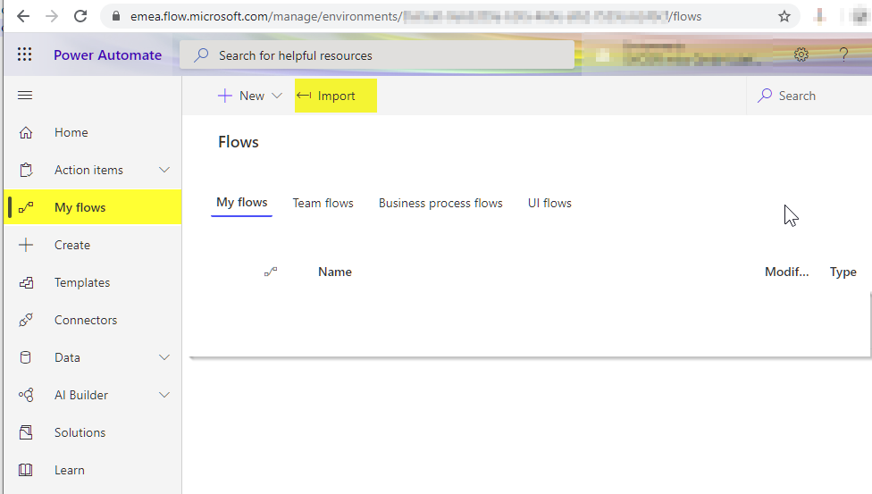
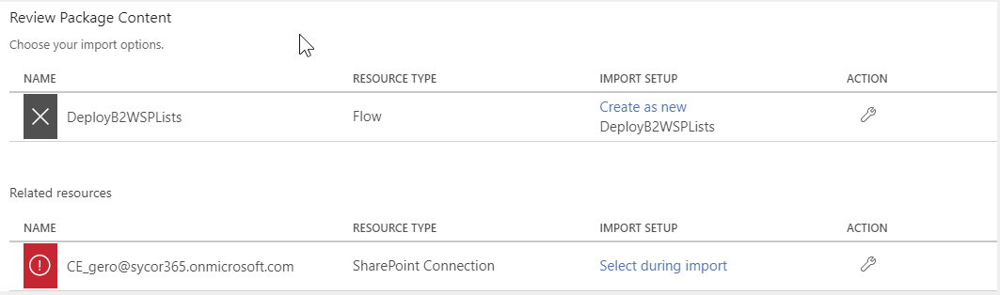

# Install all lists

The data backend for this solution is SharePoint. So all lists needed by this solution must be stored on a SharePoint site. To help you to deploy all needed lists, we designed a PowerAutomate Flow that is generating all lists for this solution. You can deploy the lists to a site collection or to a subsite. We suggest to deploy the lists to a subsite.

Follow these steps to generate the lists for the data backend of this solution:
* Download the PowerAutomate Flow DeployBack2WorkLists.zip from the /src- folder
* Open  your Office365 PowerAutomate Admin Center and navigate to MyFlows and than hit the Import-Button

* Select the just downloaded file "DeployBack2WorkLists.zip" for upload
* Review the package content and make the necessary changes
	* Choose as import option for the flow object "Create as new"
	* Select a SharePoint Site Collection Admin for the SharePoint Connection

