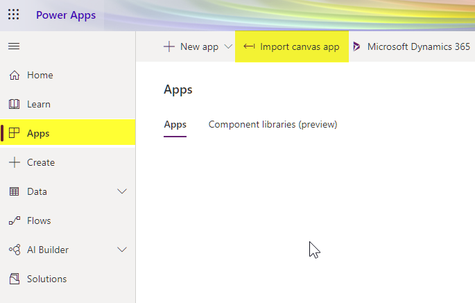
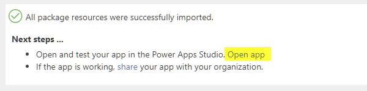
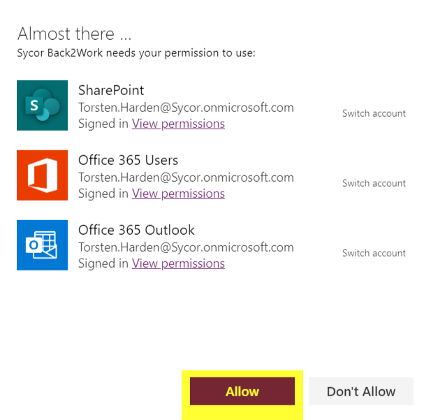
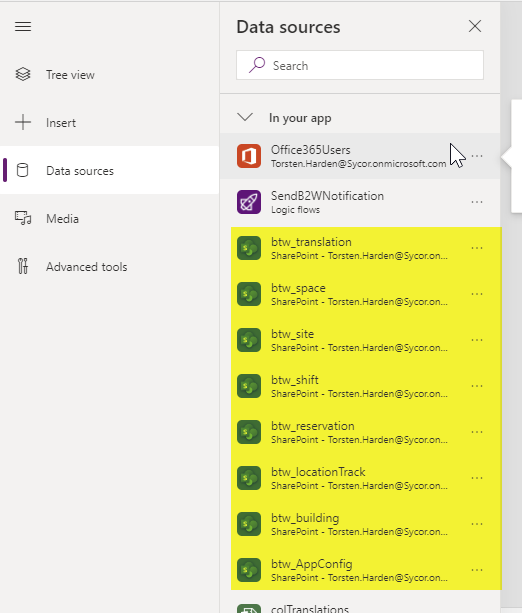

# Install the end user PowerApp
The end user PowerApp is what employees will see on their PowerApp App on their smartphones:
1. Open your environment in https://make.powerapps.com, sign in with administrator credentials, navigate to Apps and select "Import Canvas App"

1. Select a valid Outlook connection for your environment and hit Import .
1. Now you have to connect the app with our SharePoint data model. For this task you will have to open the app in PowerApps Studio. On the top of the screen you will find a link to PowerApps Studio. 
1. When opening PowerApps Studio you will first have to grant permissions to SharePoint, Office 365 Users and Office 365 Outlook. Hit the allow button. 
1. Next you navigate to Data Sources and delete the existing links to the sharepoint datasources. These are the following datasources: btw_translation, btw_space, btw_site, btw_shift, btw_reservation, btw_locationTrack, btw_building, btw_AppConfig 

